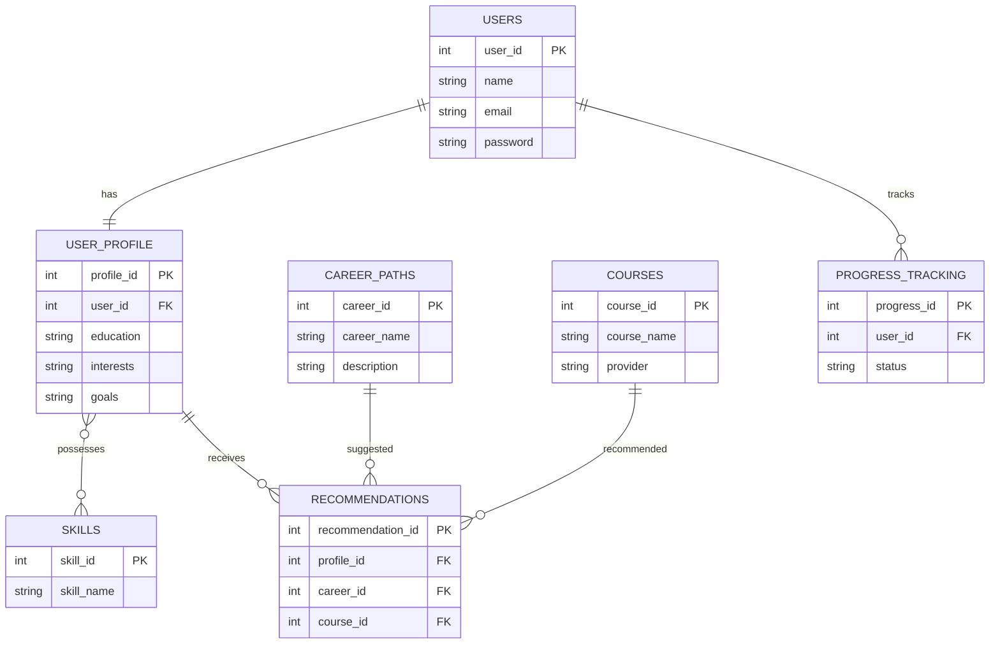

# One-Stop Personalized Career and Education Advisor

## Slide 1: Project Title

**One-Stop Personalized Career and Education Advisor**

**Tagline:** Empowering students and professionals with personalized education and career guidance.

## Slide 2: Problem Statement

Students and job seekers often face challenges in selecting suitable educational pathways and career options due to a lack of personalized guidance, fragmented information sources, and limited awareness of industry requirements. This results in uninformed decisions, skill gaps, and reduced career growth opportunities.

## Slide 3: Project Objective

* Provide personalized career and educational recommendations.
* Analyze user interests, skills, and academic performance.
* Recommend suitable courses, certifications, and career paths.
* Identify skill gaps and suggest learning resources.
* Support informed decision-making for long-term career success.

## Project Modules

1. User Management Module
2. Profile & Skill Assessment Module
3. Career Recommendation Module
4. Education Recommendation Module
5. Course & Certification Module
6. Progress Tracking Module
7. Admin Management Module

## Main Database Tables

* Users
* User_Profile
* Skills
* Career_Paths
* Courses
* Certifications
* Recommendations
* Progress_Tracking
* Admin

## ER Diagram (Mermaid)

